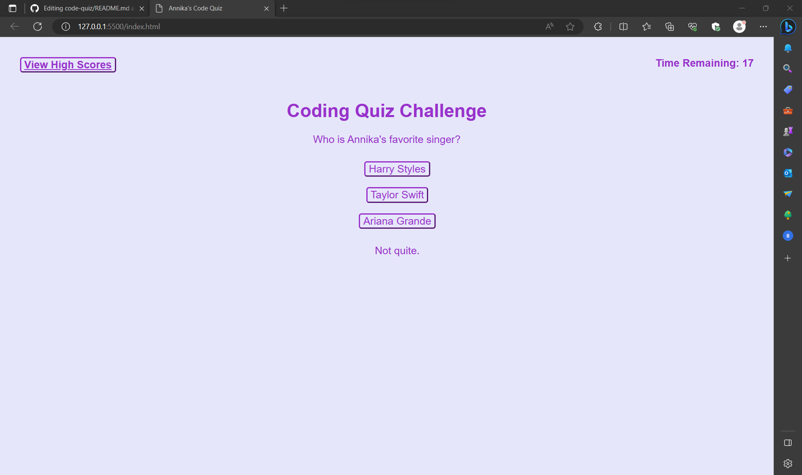

# code-quiz

## User Story

```
AS A coding boot camp student
I WANT to create a timed quiz on that stores high scores
SO THAT I can gauge my ability to perform Javascript fundamentals
```

## Acceptance Criteria

```
GIVEN I am taking a quiz
WHEN I click the start button
THEN a timer starts and I am presented with a question
WHEN I answer a question
THEN I am presented with another question
WHEN I answer a question incorrectly
THEN time is subtracted from the clock
WHEN all questions are answered or the timer reaches 0
THEN the game is over
WHEN the game is over
THEN I can save my initials and my score
```

## Live Webpage 

https://annikacrossley.github.io/code-quiz/


